# Custom Vision - Workshop

Hi everyone and welcome!
In this tutorial you are going to create a Machine Learning model that can identify an object that you hold in front of a camera.

## Background Concept

Before we get started, let's learn about "why" you would do this in the first place.
The short answer is, using machine learning teaches the camera to **look**.  Cameras just see pictures through lens but the model inside of it makes it intelligent and can identify objects it is looking for.

## Let’s walk through an example that you will learn how to build in this lab using fruit

- The camera is pointing at some fruit.  
- Send the image to the machine learning **model**
- The machine learning model tells you what's in the image

Without any machine learning on your camera, you will just see an image of fruit.  The machine learning model makes the camera intelligent.

- Camera lens is like your eyes  
    When you are looking at something but not paying attention, you do not recognize.  You just see them.  (or just sensing)
- Machine learning model is like your brain  
    When you are paying attention, you send what you see to your brain so you can recognize items.  (or Observing or recognizing)

### How does anyone learn anything?

Think of when you were young before you could read. These are the steps you used to learn:

- You would be shown a flash card with a picture on it or you were given an object to feel.
- The object was an Apple.
- Next to the picture was written the word "Apple" or it was written in braille for you.

**This** is how you learned to connect the word to the object in the picture.

Teaching a computer to know what an apple is **works the same way**.

You show it a lot of pictures and tell it those are apples.  This is called **tagging**.  Just like you make connection between a picture of apple and letter "**A** **P** **P** **L** **E**", computer learns what it sees and what it is called.  Then, to put it simply, it makes a little program that you can install on your camera.  Once you do, if your camera could talk, it would say, "I am now smart enough to know when I see an apple come into view."  

That is called "**training the model**".  

In the first section of this lab you will how to train the model to identify fruit.

## From Apples to Elephants

Once you complete the steps in this lab, which uses fruit as an example, there is conceptually no difference between whether you taught the computer to know apples, oranges, cats, or elephants.

Like learning to ride a bike.

Once you know the basics, you can ride all sorts of different bikes using the same concepts of pedaling, balancing, steering, and ringing a bell to make sure people know you are coming their way.  

Just takes some practice and in no time, you are on your way!

## How do Camera Traps work?

They work the same way!  

The scientist trains the machine learning model to identify something, like a Snow Leopard. Then that model is put on the smart camera and runs on it. Every picture the camera takes through its lens is sent to the model and is looked at just waiting to see if a picture is a snow leopard.  

It would go something like this, if you can imagine a camera could talk:

- **Camera:**  
    "just waiting here… sending every snapshot I see through my lens to a machine learning model I was given… "

- **The ML Model inside the camera:**  
    "Nope. Nope. Nope. Nothing to see here. Nope. Nothing I know.  Nothing much going on today…"  
  
- *The Snow Leopard walks by.*  

- **Camera:**  
    "Still sending everything I see to my friend the machine learning model"

- **The ML Model inside the camera:**  
    "Wait… waaaaaait… I know this… OMGOSH! I KNOW WHAT THAT IS! I WAS TRAINED FOR THIS! THAT IS A SNOW LEOPARD!!!!"

So that's what a camera trap is doing, waiting to see something it recognizes using a little program you trained to identify the object.  
In a future lab we will learn how the camera acts once an object is identified and tells the rangers.

You can learn more about how camera traps are used in the wild by listening to the [Club 15 interview](https://kidscansaveanimals.com/episodes/eric-dinerstein/) with Dr. Eric Dinerstein.

## LET'S GO\!

### 1. Getting an Azure Subscription

To run this tutorial you need to have an Azure Subscription. If you are a minor you should ask one of your parents or a guardian to help you with signing up. If you are above 13 years old you might be able to use the [Microsoft Azure for Students Starter Offer](https://azure.microsoft.com/offers/ms-azr-0144p/?WT.mc_id=aiml-25242-heboelma)

To sign up for an Azure Subscription [Click here](https://azure.microsoft.com/free/?WT.mc_id=aiml-25242-heboelma)

### 2. Build a fruit classifier project

Now we can build our classifier! navigate to [https://www.customvision.ai](https://www.customvision.ai/?WT.mc_id=aiml-25242-heboelma).

1. Navigate to [https://www.customvision.ai](https://www.customvision.ai/?WT.mc_id=aiml-25242-heboelma)

    

1. Sign in with your Azure account credentials.
1. Accept **Terms of Service**

    

1. Click `NEW PROJECT` to create a new project  

    

1. Click `create new`

    

1. Select your Azure Subscription  

    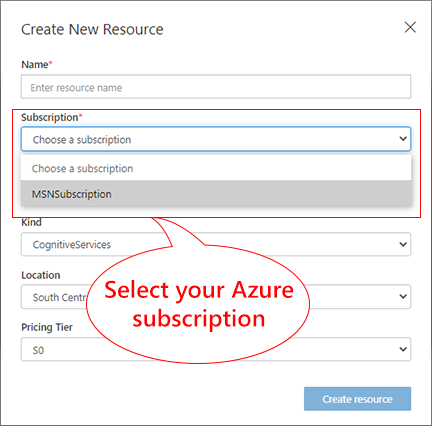

1. Create a **Resource Group**  

    Resource group provides a way to organize services.  In this lab, we will create multiple services including Custom Vision.  We will create all resources in the **Resource Group**

    Click `create new`  

    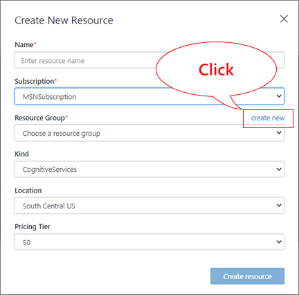

1. Give a name to a new resource group and select location  
    Then click `Create resource group` to create a new resource group

    

    | Item           | Value                                                                               |
    |----------------|-------------------------------------------------------------------------------------|
    | Name           | Name of the resource group.  E.g. Club15-ComputerVision                             |
    | Location       | Select a location nearest to you. Pick the same location as the new resource group. |

    > [!TIP]  
    > You can see locations in a map at <https://azure.microsoft.com/en-us/global-infrastructure/geographies/>  

1. Fill out information for the new project  
    Then Click `Create resource`

    

    | Item           | Value                                                                               |
    |----------------|-------------------------------------------------------------------------------------|
    | Name           | Name of the project.  E.g. Club15-Fruit-Project                                     |
    | Subscription   | Select your Azure subscription                                                      |
    | Resource Group | Select the resource group just created.  E.g. Club15-ComputerVision                 |
    | Kind           | Cognitive Service                                                                   |
    | Location       | Select a location nearest to you. Pick the same location as the new resource group. |
    | Pricing Tier   | S0                                                                                  |

1. Give a name to a new project and optional description  
    Then select a new resource created earlier.  Once a resource is selected, you will see more options.

    

    | Setting              | Value                                                                              |
    |----------------------|------------------------------------------------------------------------------------|
    | Name                 | Fruit Project                                                                      |
    | Description          | Add a description of the classifier (example shown in image above)                 |

1. Fill out information to create a new Custom Vision project  
    Then click `Create project` to create a new project

    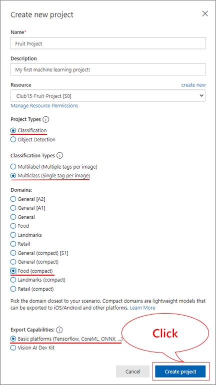

    | Setting              | Value                                                                              |
    |----------------------|------------------------------------------------------------------------------------|
    | Name                 | Fruit Project                                                                      |
    | Description          | Add a description of the classifier (example shown in image above)                 |
    | Resource             | Choose the resource you created in the previous step.   E.g. Club15-Fruit-Project  |
    | Project Type         | Classification                                                                     |
    | Classification Types | Multiclass (Single tag per image)                                                  |
    | Domains              | Food (compact)                                                                     |
    | Export Capabilities  | Basic platforms                                                                    |

#### Your new Custom Vision project is ready for you to train a machine learning model

Let's start training a machine learning model!
  
### 3. Teach the machine learning model pictures of fruits and their names

Now you can start adding images with tags to create your first machine learning model.

1. Click [Fruit dataset](https://github.com/aiadvocates/Fruit-Dataset/raw/main/fruit.zip) to download `fruit.zip` file
1. Unzip `fruit.zip` to your computer
  
    e.g. C:\fruit

1. Open Fruit Project in your browser, then click `Add images`

    

1. Select the folder you unzipped Fruit.zip file

    E.g. C:\Fruit

    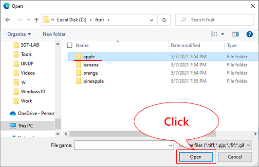

1. Select folder `apple`, then select all images, click `Open` to upload all apple images

    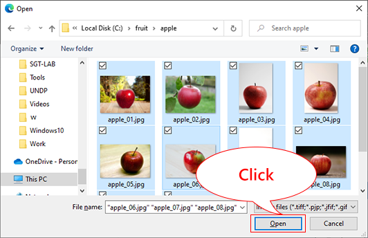

1. Add the tag 'Apple' then click `Upload 10 files`  

    

1. Confirm 10 images are upload

    

#### You just showed 10 images and taught they are called **Apple**.

Let's teach other fruits too!

To teach more fruits, click `Add images` then repeat the same step above.

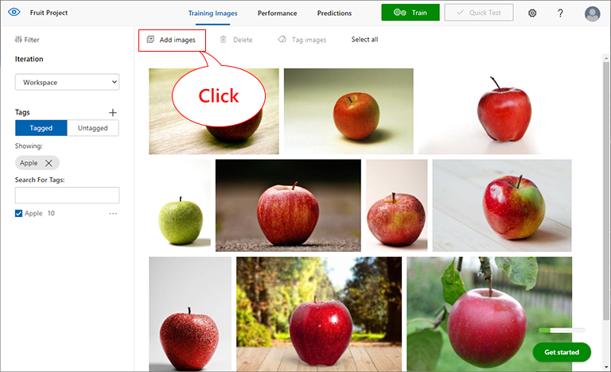

#### Now you taught Apples, Bananas, Pineapples, and orange.

Make sure you see 4 fruits and each with 10 pictures.  

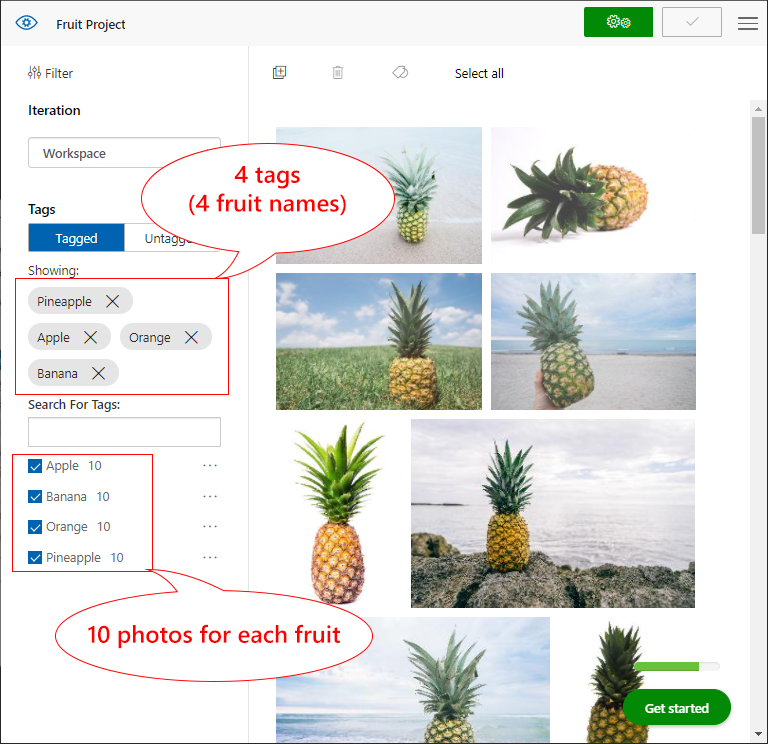

### 4. Train Model

Now you are ready to train your model on the fruit image data you have uploaded.  Just like all of us, we have to **remember** what we just learned.  By looking at different kinds of apples such as red vs. green, different shapes, etc, we learn more about apples.  The machine learning works the same way.  We just showed pictures of fruits and their names, but the machine learning model also needs to learn and remember.  This process is called **Training the model**.

#### Let's train your machine learning model

1. Click the green `gear icon` in the top right corner.  

    For this lab, you can use the "Quick Training" option.

    

1. Wait until the training completes

    Training takes a few minutes.

    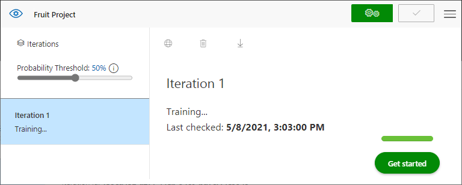

    Once the training process is complete, Computer Vision will show you machine learning evaluation metrics for your model.

    

### 5. Test Machine Learning Model

Now your machine learning says it learned 4 fruits.  Let's give it some quiz to see how well it remembered.  

Choose the 'Quick Test' button in the top right *(next to the train button)* this will open a window where you can specify a picture for the quiz.  

1. Use one of the image links below.  
    These are not used to train the machine learning, so they are new to the machien learning.
1. Paste the link in the Image URL field.  

The machine learning model saw images and tell what's in the image.

The image will be sent to the machine learning model.  The machine learning then evaluate the image.  This process is called **Analysis**.

The machine learning model answers to the quiz with the name (tag) with confidence level.  This process is called **Inference** and the answer is called **Inference Result**.

<https://github.com/aiadvocates/Fruit-Dataset/raw/main/test/apple.jpg>

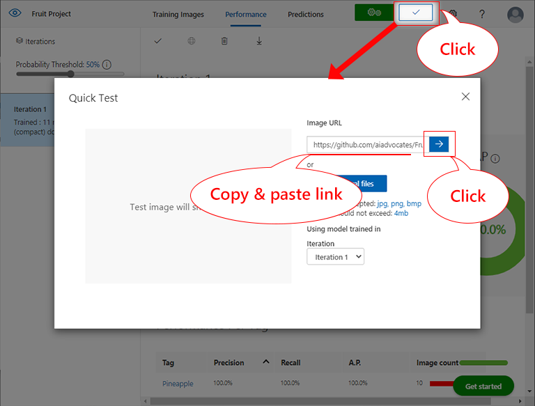

E.g.  The machine learning says this image is apple with 96.7% confidence.

> [!TIP]  
> Give more quiz with other images, or search online for other images to see how the model performs.  
> <https://github.com/aiadvocates/Fruit-Dataset/raw/main/test/apple.jpg>  
> <https://github.com/aiadvocates/Fruit-Dataset/raw/main/test/banana.jpg>
> <https://github.com/aiadvocates/Fruit-Dataset/raw/main/test/orange.jpg>
> <https://github.com/aiadvocates/Fruit-Dataset/raw/main/test/pineapple.jpg>

Now you have trained a model that can observe the difference between 4 fruits.  
Feel free to take out your camera and add an other fruit, or maybe create a completely different model.

Ideas for other models to make using pictures:

- Your pets - Imagine a camera that you could tell which pet was sleeping in your bed!
- Wild animals you like - Just like a real life use case to protect animals!
- Different toys!

## Use your machine learning model in the real world

When you learned fruits, you were able to pick right fruits when you went to a grocery store, for example.  If you don't use your knowledge, there is very little value.  So let's use your machine learning model in the real world scenario, similar to what camera traps do.

In this last part we are going to take your machine learning model and use it in an web site.  The web site is running an application.  This is called **WebApp**.  The WebApp uses webcam and your machine learning model, and tells what it sees through camera.

The goal is to hold an apple in front of your webcam and the application will tell you if it is a apple or not.

### 1. Download the model

WebApp needs to use your machine learning model.  Once WebApp is up and running, we need to upload your machine learning model.  
Let's download your machine learning model so we can upload to your WebApp later.

There are many techniques for Machine Learning models.  These techniques are often referred to as machine learning frameworks or formats.  In this lab, we are going to use **TensorFlow.js** format.

Let's convert your machien learning model to TensorFlow.js format.  This process is called **Exporting** model.

1. Click on Performance in the top menu
1. Click on Export
1. Click on TensorFlow

    

1. In the dropdown box select TensorFlow.js

    

1. Click Export (Wait a few seconds for the model to be ready for export)

    

1. Click Download

    

> [!TIP]  
> Now you should have received a .zip file with a long name.

### 2. Setup the Web Application (WebApp)

Let's set up your WebApp.  In this lab, we will install and set up a web site with an application.  This process is called **deploying service**.

Click the blue `Deploy to Azure` button below to start the deployment of a WebApp in your Azure Subscription.  

> [!NOTE]  
> Don't worry, the webapp is using the **free** tier of Azure WebApps so it will not cost you money.

After clicking the button, you should see the screen below.

> [!IMPORTANT]  
> Please make sure you are successfully logged in to Azure when prompted.

1. Fill in the missing fields:

    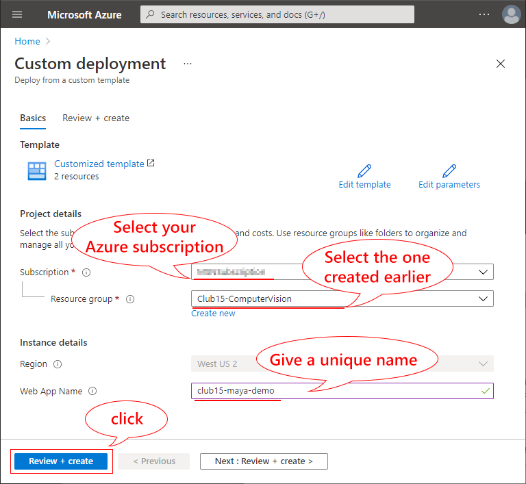

    | Item           | Value                                                                        |
    |----------------|------------------------------------------------------------------------------|
    | Subscription   | Select your Azure subscription                                               |
    | Resource group | Select the previously created Resource group. E.g. Club15-ComputerVision     |
    | Region         | Should be automatically selected based on your Resource Group location       |
    | Web App Name   | Enter a name (like: club15-maya or club15-yourName), no spaces allowed.      |

    > [!TIP]  
    > The name of WebApp must be globally unique, meaning, only one in the world.  So be creative!

1. Click `Review + Create`  

    Azure portal checks a few things before start deploying.

1. Click `Create`

    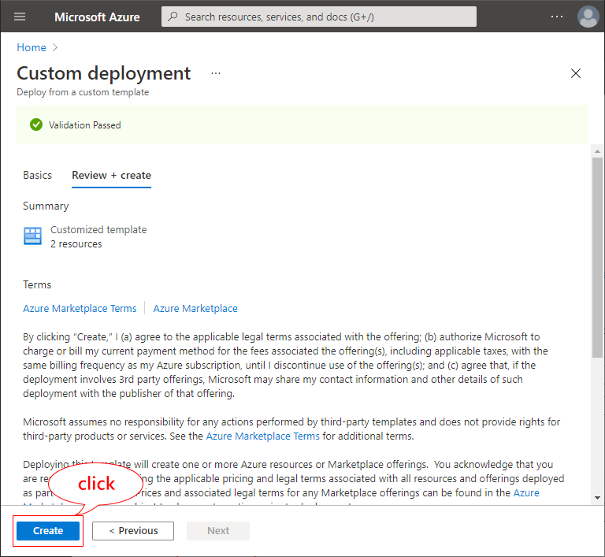

    Now you can take a 5 minute break.

    

### 3. Access WebApp

When the deployment is complete you see the message: "Your deployment is complete".  You should be able to access your WebApp with your favorite internet browser.

Let's find the address of WebApp.

1. Click `Go to resource group`  

    

    In the resource group, you should see 3 items.  (These are called resources).

    - App Service Plan : For WebApp
    - App Service : For WebApp
    - Cognitive Service : For Custom Vision project

1. Click on the `App Service` Item

    This item should have the same name as you entered in the steps before. (Like: club15-maya or club15-yourName)

    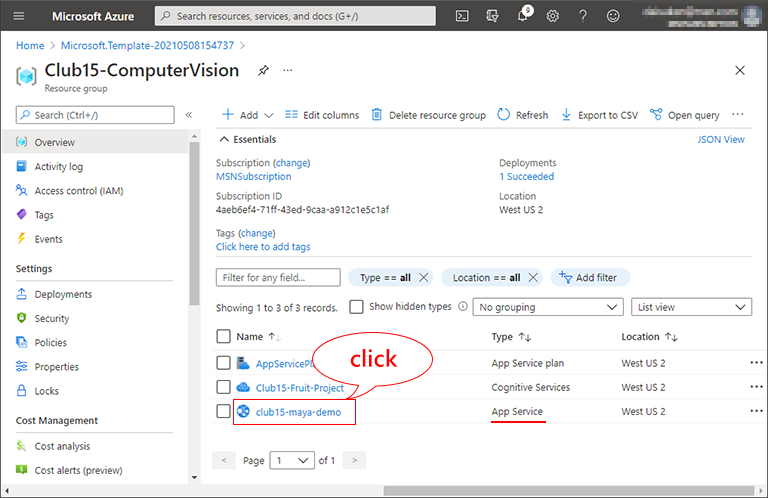

1. Access the WebApp by clicking `URL`  

    Your WebApp is now up and running and you can now upload your model and test it!

    

1. The first time it may take 30 seconds or so but you should see :

    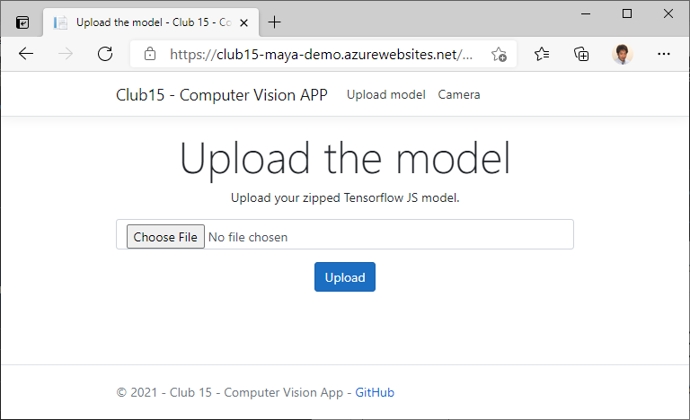

### 4. Upload Machine Learning Model

Your WebApp is ready!  

Let's upload your machine learning model you downloaded earlier.

1. Click `Choose File`
1. Select the zip file you have downloaded in the previous step. (The one with the long file name.)
1. Click `Upload`

### 5. Show your fruits to Machine Learning\!

Your WebApp is given a new brain to identify fruits in your machine learning model.  

Let's show fruits through webcam and see if WebApp can recognize fruits!

1. When the upload is complete the browsers asks to access your camera. Click "Allow"

    By allowing access to your webcam, you are giving eyes to WebApp.

    

1. On the screen you should now see your camera
1. Go to the kitchen and pick an apple or banana and hold it in front of the camera.

    

## Completed\!

When WebApp can recognize (or understand) fruits in the video view, it tells you **I see : Apple** etc.  This means WebApp can now understand what it sees through webcam.

